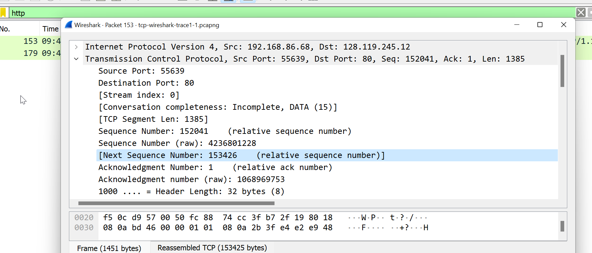
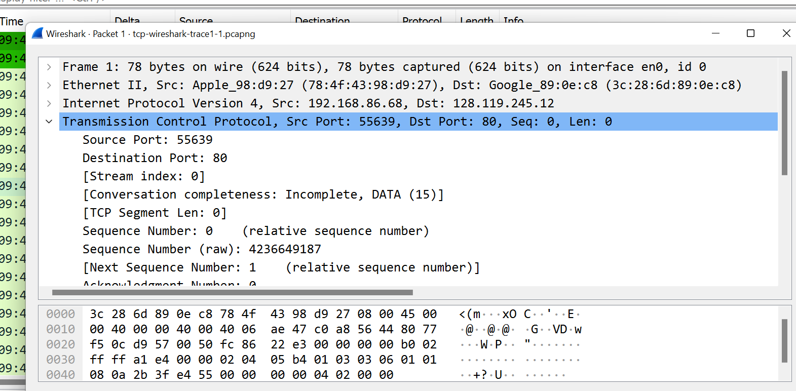
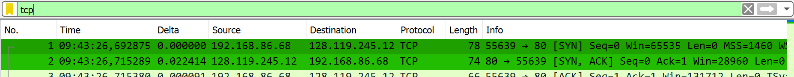
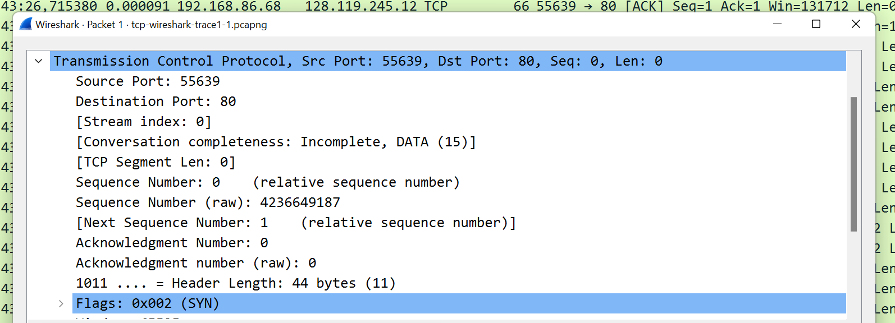

# tcp-udp-wireshark

Nama : Muhammad Choirun Ni'am
NRP : 5025221203

<h1>Problem TCP</h1>
1. What is the IP address and TCP port number used by the client computer (source) 
that is transferring the alice.txt file to gaia.cs.umass.edu?

The source of IP Address is 192.168.86.68 and source port is 55639.

2. What is the IP address of gaia.cs.umass.edu? On what port number is it sending 
and receiving TCP segments for this connection?

3. What is the sequence number of the TCP SYN segment that is used to initiate the 
TCP connection between the client computer and gaia.cs.umass.edu?

4. What is the sequence number of the SYNACK segment sent by gaia.cs.umass.edu 
to the client computer in reply to the SYN? What is it in the segment that 
identifies the segment as a SYNACK segment? What is the value of the
Acknowledgement field in the SYNACK segment? How did gaia.cs.umass.edu 
determine that value?

5. What is the sequence number of the TCP segment containing the header of the 
HTTP POST command?

6. What is the length (header plus payload) of each of the first four data-carrying 
TCP segments?

7. What is the length (header plus payload) of each of the first four data-carrying 
TCP segments?

8. What is the minimum amount of available buffer space advertised to the client by 
gaia.cs.umass.edu among these first four data-carrying TCP segments? Does the 
lack of receiver buffer space ever throttle the sender for these first four data carrying segments?

9. Are there any retransmitted segments in the trace file? What did you check for (in 
the trace) in order to answer this question?

10. How much data does the receiver typically acknowledge in an ACK among the 
first ten data-carrying segments sent from the client to gaia.cs.umass.edu? Can 
you identify cases where the receiver is ACKing every other received segment 
(see Table 3.2 in the text) among these first ten data-carrying segments?

11. What is the throughput (bytes transferred per unit time) for the TCP connection? 
Explain how you calculated this value.

